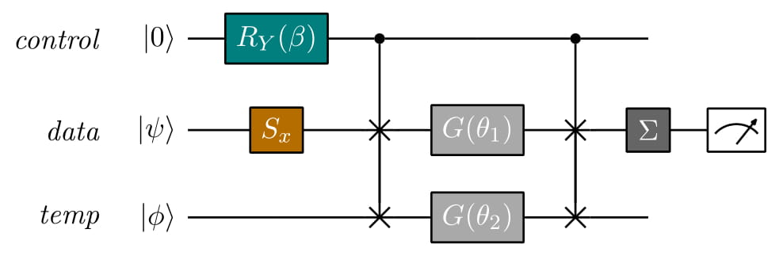

# qSLP: A Variational Algorithm for Quantum Neural Networks

This repository contains the code to reproduce the results in the paper [A Variational algorithm for Quantum Neural Networks](https://link.springer.com/chapter/10.1007/978-3-030-50433-5_45), 
published in the [International Conference on Computational Science 2020, Quantum Computing track](https://www.iccs-meeting.org/iccs2020/). 
# Description

In this work, we introduce a novel variational algorithm for quantum Single Layer Perceptron. Thanks to the universal 
approximation theorem, and given that the number of hidden neurons scales exponentially with the number of qubits, our 
framework opens to the possibility of approximating any function on quantum computers. Thus, the proposed approach 
produces a model with substantial descriptive power, and widens the horizon of potential applications already in the 
NISQ era, especially the ones related to Quantum Artificial Intelligence. In particular, we design a quantum circuit to 
perform linear combinations in superposition and discuss adaptations to classification and regression tasks. After this 
theoretical investigation, we also provide practical implementations using various simulation environments. Finally, we
 test the proposed algorithm on synthetic data exploiting both simulators and real quantum devices.

# Quantum Circuit

Intuitively, a qSLP can be implemented into a quantum computer in two steps. 
Firstly, we generate different linear operations in superposition, each one having different parameters 
, 
entangled with a control register. 
Secondly, we propagate the activation function to all the linear combinations in superposition. 
Notice that,  thanks this approach, instead of executing a given activation function for each hidden 
neuron, we need only one application to obtain the output of all the neurons in the hidden layer.
To this end, three quantum registers are necessary:  
*control*, *data* and *temp*. 
The latter is responsible for generating the linear combinations of the input data in superposition. Also, it can be in any arbitrary state, possibly even unknown.  

  

The circuit above leads to the following quantum state: 

where the two linear operations, ,
are put 
through the same activation function, , 
represented by the gate . 
Each output is weighed by the parameters of the control qubit , i.e. the coefficients attached to the hidden neurons in the linear combination that produces the output of the NN.
This is exactly the quantum version of the two-neurons classical SLP.

Thus, the quantum circuit described above allows reproducing a classical Neural Network with one hidden layer on a quantum computer. 

# Usage
The code implements all the experiments regarding the implementation of the quantum Single Layer Perceptron using 
two frameworks for quantum computation:
the **qml_** scripts use [pennylane](https://pennylane.ai/) and reproduce the experiments reported in the paper. The 
**qiskit_** scripts use [Qiskit](https://qiskit.org/) and allow to visualize easely the quantum circuit. The qSLP works
well in both cases, this strengthens the validity of the model which is independent from the implementation.

### Pennylane implementation:

- The script *qml_qSLP.py* contains the code for generating data and training a single classifier.

- The script *qml_multiple_runs.py* generates many dataset from two bivariate gaussian distributions with different standard
 deviations and trains the classifier for each of them.

- The script *qml-qiskit_real_device.py* executes the trained algorithm on real device, using a specific plug-in that allows to run
 the circuit using qiskit environment.

- The script *qml_Utils.py* contains the import of the needed packages and all the custom routines for evaluation.

- The script *qml_visualization.py* plots the data and the performances of the classifier.

- The script *qml_collect_results_rl.py* collects the results generated by running the quantum algorithm in a real device.

Some of the functions for optimisation are taken from https://pennylane.ai/qml/demos/tutorial_variational_classifier.html

### Qiskit implementation:

- The script *qiskit_qSLP.py* contains the code for generating data and training a single classifier. Also it allows to visualise the two-layer qSLP.

- The script *qiskit_Utils.py* contains the import of the needed packages and all the custom routines for evaluation.

## Issues

For any issues or questions related to the code, open a new git issue or send a mail to antonio.macaluso2@unibo.it

